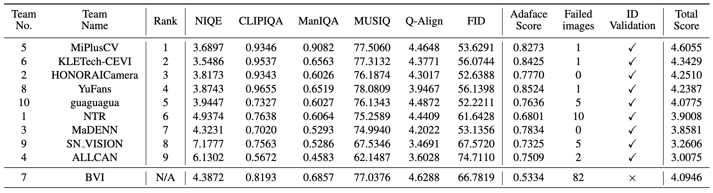

# [NTIRE 2026 Challenge on Real-World Face Restoration](https://cvlai.net/ntire/2026/) @ [CVPR 2026](https://cvpr.thecvf.com/)

[](https://www.cvlai.net/ntire/2026/)
[](https://arxiv.org/abs/2604.10532)
[](https://ntire-face.github.io/2026/)
[](https://github.com/jkwang28/NTIRE2026_RealWorld_Face_Restoration)
[](https://www.cvlai.net/ntire/2026/NTIRE2026awards_certificates.pdf)
[](https://github.com/jkwang28/NTIRE2026_RealWorld_Face_Restoration)

## About the Challenge

This challenge focuses on restoring real-world degraded face images. The task is to recover high-quality face images with rich high-frequency details from low-quality inputs. At the same time, the output should preserve facial identity to a reasonable degree. There are no restrictions on computational resources such as model size or FLOPs. The main goal is to **achieve the best possible image quality and identity consistency**. 
Participants are ranked based on visual quality while ensuring identity similarity above a threshold; final scores combine several no-reference IQA metrics and FID. 

## Challenge results
**Test Set** – 450 low-quality (LQ) images drawn from five real-world subsets (WIDER-Test, WebPhoto-Test, CelebChild-Test, LFW-Test, and CelebA) are provided for evaluation.  

**Identity Validation** – Cosine similarity is measured with a pretrained **AdaFace** model. Thresholds: 0.30 (WIDER & WebPhoto), 0.60 (LFW & CelebChild), 0.50 (CelebA). A submission fails if more than ten faces fall below the dataset-specific threshold.  

**Metrics** – Valid submissions are scored with six no-reference metrics: **CLIPIQA, MANIQA, MUSIQ, Q-Align, NIQE,** and **FID** (against FFHQ).  

**Overall Score**

$$
\text{Score} = \text{CLIPIQA} + \text{MANIQA} + \frac{\text{MUSIQ}}{100} + \max\left(0, \frac{10 - \text{NIQE}}{10}\right) + \frac{\text{QALIGN}}{5} + \max\left(0, \frac{100-\text{FID}}{100}\right).
$$

**Ranking rule** – Teams are first screened by the identity filter; qualifying entries are ranked descending by the overall score. Minor deviations between Codalab and reproduced scores are tolerated after code verification.  

**Resources** – Official evaluation scripts, pretrained models, and baseline code are available in this public repository.  

<p align="center">

</p>

## Conclusion

The NTIRE 2026 Real‑World Face Restoration Challenge accelerated progress in blind face‑restoration and clarified which strategies work best in practice. 

The track drew **96 registrants and 9 valid finalists**, using an AdaFace identity filter (cosine ≥ 0.20–0.60 depending on dataset) before scoring. This ensured models work on real images—avoiding overfitting to synthetic data.

Key insights are:
1. One-step or distilled diffusion priors dominate the top ranks.
2. Metric-oriented refinement becomes a key differentiator.
3. Semantic and structural guidance remains essential for identity-safe restoration.
4. Modular multi-stage designs are still highly competitive.
5. Foundation-model adaptation is replacing purely task-specific restoration backbones.

About more detailed analysis and the solution from each teams, please refer to [the challange report](https://arxiv.org/abs/2604.10532). 

## About this repository

This repository summarizes the solutions submitted by the participants during the challenge. The model script and the pre-trained weight parameters are provided in the [models](./models) and [model_zoo](./model_zoo) folders. Each team is assigned a number according to the submission time of the solution. You can find the correspondence between the number and team in [test.select_model](./test.py). Some participants would like to keep their models confidential. Thus, those models are not included in this repository.

## How to test the model?

[TBD]

## How to eval images using NR-IQA metrics and facial ID?

### Environments

```sh
conda create -n NTIRE-FR python=3.8
conda activate NTIRE-FR
pip install -r requirements.txt
```

### Metrics include:
1. **NIQE**, **CLIP-IQA**, **MANIQA**, **MUSIQ**, **Q-Align**  
   - Provided by [IQA-PyTorch](https://github.com/chaofengc/IQA-PyTorch)

2. **FID** (using FFHQ as reference)  
   - Provided by [VQFR](https://github.com/TencentARC/VQFR)
3. **Facial ID Consistency**
   - Model Provided by [AdaFace](https://github.com/mk-minchul/AdaFace)

### Pretrained Weights
You should first create a folder named `pretrained` in the root directory and download the following weights into it:

- adaface_ir50_ms1mv2.ckpt ([Google Drive](https://drive.google.com/file/d/1eUaSHG4pGlIZK7hBkqjyp2fc2epKoBvI/view?usp=sharing))
- inception_FFHQ_512.pth ([Google Drive](https://drive.google.com/drive/folders/1k3RCSliF6PsujCMIdCD1hNM63EozlDIZ?usp=sharing))

### Folder Structure
The val data and test data could be downloaded at [Google Drive](https://drive.google.com/drive/folders/1ruyMYFuZNAQb9ntN77KhV86os1icZpU5?usp=sharing). 
```
input_LQ_dir
├── test
│   ├── CelebA
│   ├── CelebChild-Test
│   ├── ...
├── val
│   ├── CelebA
│   ├── CelebChild-Test
│   ├── ...
    
output_dir_test
├── CelebA
├── CelebChild-Test
├──...
output_dir_val
├── CelebA
├── CelebChild-Test
├──...
```

### Command to calculate metrics

```sh
python eval.py \
--mode "test" \
--output_folder "/path/to/your/output_dir_test" \
--lq_ref_folder "/path/to/input_LQ_dir" \
--metrics_save_path "./IQA_results" \
--gpu_ids 0 \
--use_qalign True 
```

The `eval.py` file accepts the following 6 parameters:
- `mode`: Choose whether to test images from the `test` set or the `val` set.
- `output_folder`: Path where the restored images are saved. Subdirectories should be organized by dataset names.
- `lq_ref_folder`: Path to the LQ images provided as input to the model. This path should be the parent directory of the `test` and `val` sets.
- `metrics_save_path`: Directory where the evaluation metrics will be saved.
- `device`: Computation devices. For multi-GPU setups, use the format `0,1,2,3`.
- `use_qalign`: Whether to use Q-Align or not, which will consume an additional 15GB of GPU memory.

### Weighted score

We use the following equation to calculate the final weighted score: 

$$
\text{Score} = \text{CLIPIQA} + \text{MANIQA} + \frac{\text{MUSIQ}}{100} + \max\left(0, \frac{10 - \text{NIQE}}{10}\right) + \frac{\text{QALIGN}}{5} + \max\left(0, \frac{100-\text{FID}}{100}\right).
$$

The score is calculated on the averaged IQA scores on all the val/test datasets. 

## NTIRE Real-world Face Restoration Challenge Series

Code repositories and accompanying technical report PDFs for each edition:  

- **NTIRE 2026**: [Github Repo](https://github.com/jkwang28/NTIRE2026_RealWorld_Face_Restoration) | [Report]() | [arXiv](https://arxiv.org/abs/2604.10532)
- **NTIRE 2025**: [Github Repo](https://github.com/zhengchen1999/NTIRE2025_RealWorld_Face_Restoration) | [Report](https://openaccess.thecvf.com/content/CVPR2025W/NTIRE/papers/Chen_NTIRE_2025_Challenge_on_Real-World_Face_Restoration_Methods_and_Results_CVPRW_2025_paper.pdf) | [arXiv](https://arxiv.org/abs/2504.14600)

## Citation

If you find the code helpful in your research or work, please cite the following paper(s).

```
@inproceedings{ntiface26face,
  title={The Second Challenge on Real-World Face Restoration at NTIRE 2026: Methods and Results},
  author={Wang, Jingkai and Gong, Jue and Chen, Zheng and Liu, Kai and Li, Jiatong and Timofte, Radu and Zhang, Yulun and others},
  booktitle={CVPRW},
  year={2026}
}
```

## License and Acknowledgement

This code repository is release under [MIT License](LICENSE). 

Several implementations are taken from: [IQA-PyTorch](https://github.com/chaofengc/IQA-PyTorch), [VQFR](https://github.com/TencentARC/VQFR), [AdaFace](https://github.com/mk-minchul/AdaFace). 
